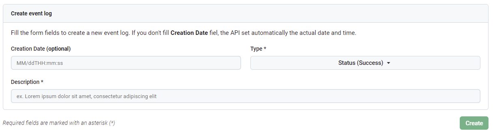
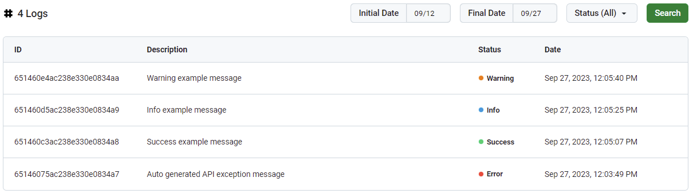

# Finaktiva Developer Technical Test

Este repositorio contiene el desarrollo de la prueba técnica de __Desarrollador Fullstack__

# Back-end

Se desarrolló un API en .NET 6

1. Ir al directorio `./back-end`
2. Ejecutar el archivo `FinaktivaBackend.sln` y abrir la solución con `Visual Studio 2022`
3. Presionar `F10` o dar clic en :arrow_forward: `Run` para ejecutar la aplicación

El API local trabajará en el host `https://localhost:7002`

# Front-end

Se desarrolló una Web Application en Angular V16

1. Abrir al directorio `./front-end` con `Visual Studio Code`
2. Usar `Ctrl` + `Shift` + `Ñ` para abrir una nueva terminal
3. Ejecutar el comando `npm i` para instalar las dependencias requeridas para la ejecución de la aplicación
4. Ejecutar el comando `ng serve -o`

La aplicacón web local trabajará en el host `http://localhost:4002`

# Database

Se hizo uso del motor `MongoDB`, la __BD__ se desplegó en el servicio de nube `MongoDB Atlas` para facilidad de ejecución del proyecto.

| Nombre       | Colección |
| ------------ | --------- |
| Registration | EventLogs |

* Estructura del documento en la colección __EventLogs__:

| Campo         | Tipo     | Ejemplo                                        |
| ------------- | -------- | ---------------------------------------------- |
| _id           | uuid     | _"5bf142459b72e12b2b1b2cd"_                    |
| descrption    | string   | _"Descripción del evento 1"_                   |
| type          | int      | `0-Success`, `1-Info`, `2-Warning` o `3-Error` |
| creation_date | datetime | _"2023-07-27T13:30:12"_                        |

# Guía de Usuario

## Tipos de eventos

| Id | Nombre  | Descripción                                                                     |
| -- | ------- | ------------------------------------------------------------------------------- |
| 0  | Success | Evento satisfactorio                                                            |
| 1  | Info    | Evento informativo                                                              |
| 2  | Warning | Evento de advertencia                                                           |
| 3  | Error   | Evento de error interno de la API. Las excepciones se almacenan automáticamente | 

## Crear log

Para guardar un `log` haga uso del formulario de creación de log. El formulario permite introducir los siguientes campos: fecha de creación, tipo y descripción.

A continuación, podrá encontrar la descripción de los campos del formulario:

| Nombre          | Descripción                        | Tipo   | Obligatorio        | Ejemplos                            |
| --------------- | ---------------------------------- |------- | ------------------ | ----------------------------------- |
| Creation Date** | Fecha y hora de creación del `log` | text   |                    | 09/27T14:30:00                      |
| Tipo            | Tipo de `log`                      | select | :heavy_check_mark: | `0-Success`, `1-Info` o `2-Warning` |
| Descripción     | Descripción detallada del `log`    | text   | :heavy_check_mark: | _Descripción del evento 1_          |

___**Nota:___ El formato de la fecha de creación es `MM/ddTHH:mm:ss`: `MM` mes, `dd` día, `HH` horas, `mm` minutos y `ss` segundos.

## Listar logs

Para listar `logs` puede hacer uso del componente de visualizar. Puede filtrar los `logs` por los siguientes filtros: fecha de inicio, fecha final y tipo.

A continuación, podrá encontrar la descripción de los campos del formulario de filtro de `logs`:

| Nombre         | Descripción     | Tipo   | Obligatorio        | Ejemplos                                       |
| -------------- | --------------- | ------ | ------------------ | ---------------------------------------------- |
| Initial date** | Fecha de inicio | text   | :heavy_check_mark: | 12/24                                          |
| Final date**   | Fecha final     | text   | :heavy_check_mark: | 09/30                                          |
| Status         | Tipo de evento  | select | :heavy_check_mark: | `0-Success`, `1-Info`, `2-Warning` o `3-Error` |

___**Nota:___ El formato de las fechas de inicio y fin es `MM/dd`: `MM` mes y `dd` día.